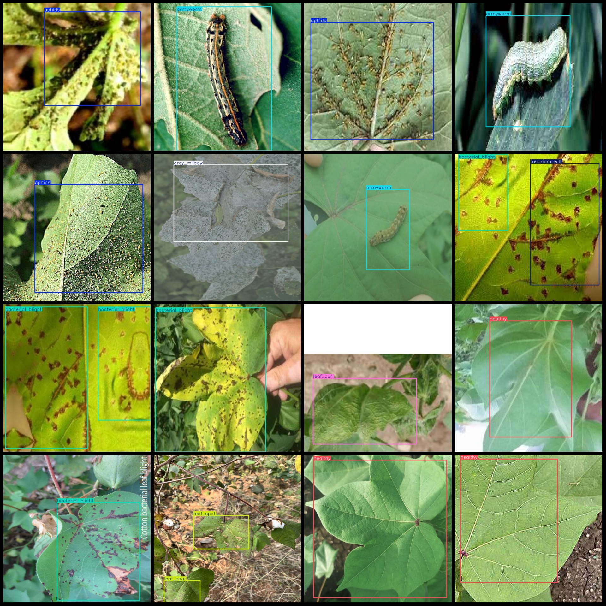
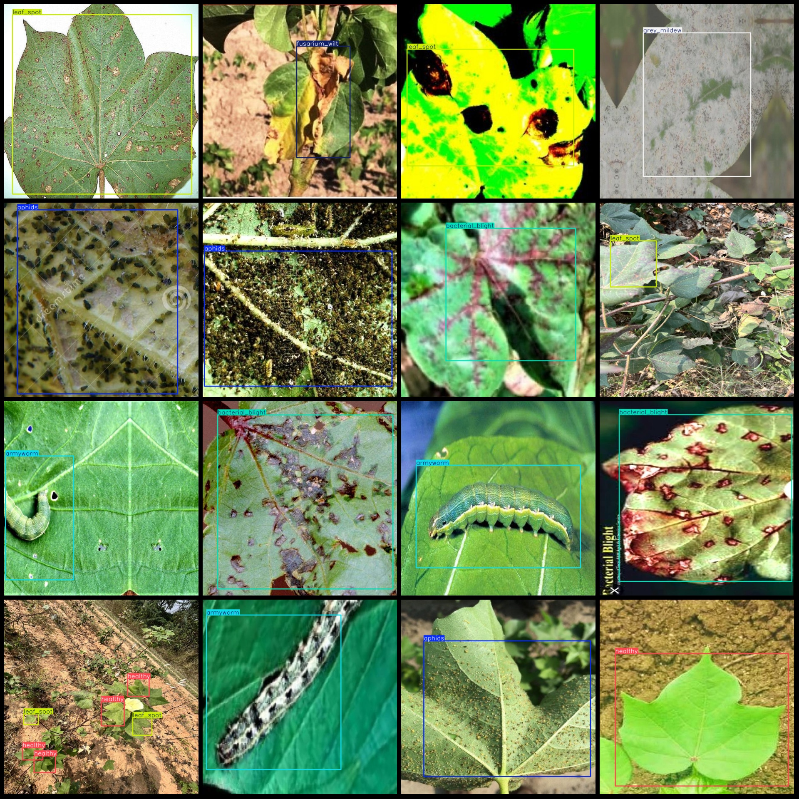

# Cotton Leaf Disease and Pest Detection Dataset in VOC+YOLO Format with 5400 Images in 8 Categories

Dataset format: Pascal VOC format + YOLO format (txt files without split paths, only containing jpg images and corresponding VOC format xml files and YOLO format txt files)
Number of images (jpg file count): 5400
Number of labels (xml file count): 5400
Number of labels (txt file count): 5400
Number of label categories: 8
Label category names (note that the order in the YOLO format is not consistent with this, but according to the classes.txt in the labels folder): ["aphids", "armyworm", "bacterial_blight", "fusarium_wilt", "grey_mildew", "healthy", "leaf_curl", "leaf_spot"]
Each category labeled with boxes:
- Aphids (Aphid) box count = 845
- Armyworm (Armyworm) box count = 802
- Bacterial_blight (Bacterial Blight) box count = 1250
- Fusarium_wilt (Fusarium Wilt) box count = 913
- Grey_mildew (Grey Mildew) box count = 244
- Healthy (Healthy) box count = 3170
- Leaf_curl (Leaf Curl) box count = 410
- Leaf_spot (Leaf Spot) box count = 1551
total boxes: 9185  
image resolution: 640x640  
Use annotation tool: labelImg
Annotation rules: draw a rectangle around the class
Important notes: None
Special statement: This dataset does not guarantee the accuracy of the trained models or weight files.
Image preview:
## Images

Here is a pay link on Stripe ( https://buy.stripe.com/3cs8yP7sY87d0vu9AB ). Please contact me lonlonago@foxmail.com after funding $89, and I will send you a complete data files , thank you!

